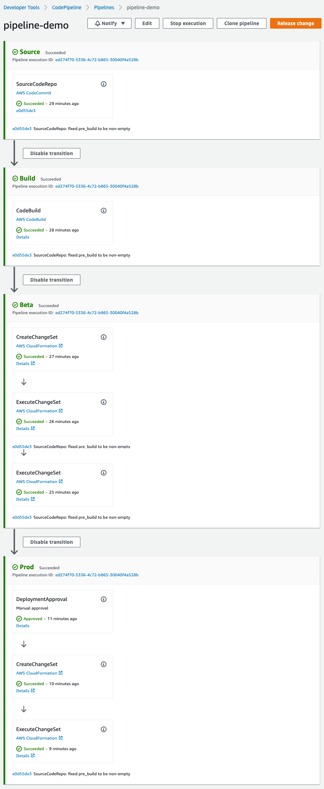

# Cookiecutter Pipeline for SAM based Serverless App


A cookiecutter template to create a generic 3-environment Pipeline for your Serverless App based on [Serverless Application Model (SAM)](https://github.com/awslabs/serverless-application-model).



## Requirements

* [AWS SAM CLI](https://github.com/awslabs/aws-sam-cli) 

## Usage

Generate a Pipeline template to your current project directory: `sam init --location gh:aws-samples/cookiecutter-aws-sam-pipeline` 

After generated you should have the following files:

```bash
├── Pipeline-Instructions.md <-- Information how to create this Pipeline
├── buildspec.yaml           <-- Sample CodeBuild spec with instructions on how to update it (in case you don't have one)
└── pipeline.yaml            <-- Cloudformation template that will generate this 3-environment pipeline
```

# Credits

* This project has been generated with [Cookiecutter](https://github.com/audreyr/cookiecutter)

License
-------

This project is licensed under the terms of the [Open Source BSD-3 License](/LICENSE)
